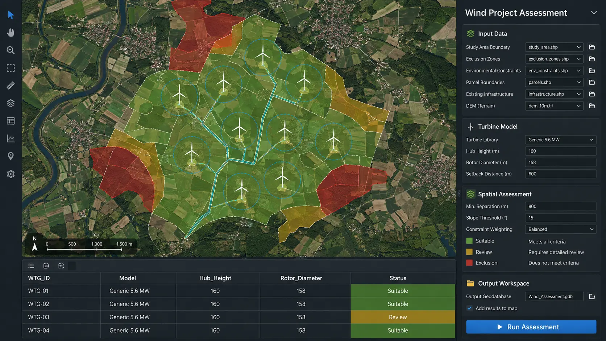
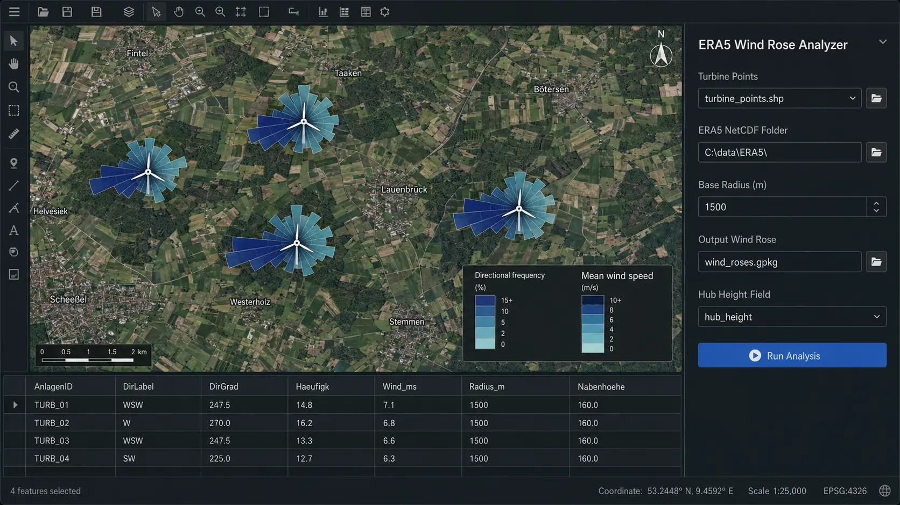
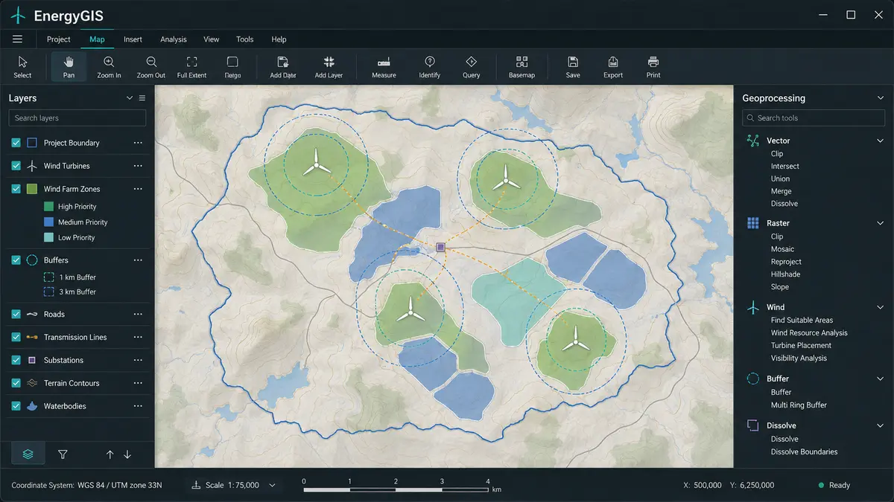
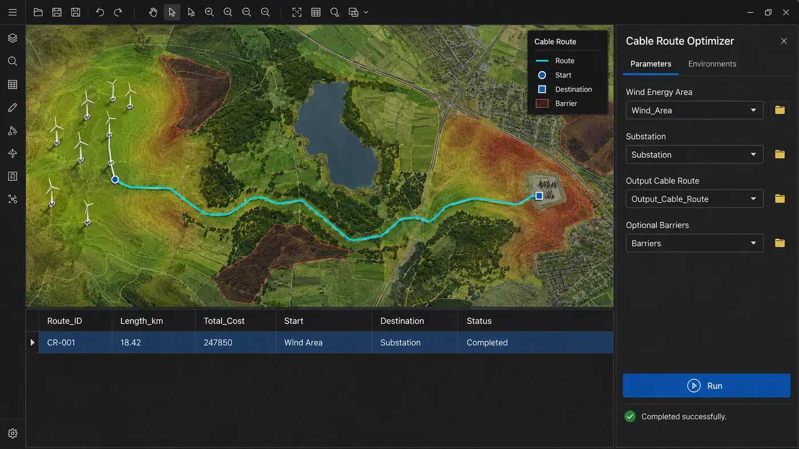

# Hi, I'm Ahmad Fahim Omar 👋

### GIS Analyst & Developer

I develop geospatial tools and automated workflows for spatial analysis, data processing, and renewable-energy planning. My work focuses on turning complex GIS processes into reliable, reusable, and user-friendly solutions.

📍 Hamburg, Germany

## Expertise

- **GIS development:** ArcGIS Pro, ArcGIS Pro SDK for .NET, ArcPy
- **Web GIS:** ArcGIS Experience Builder and ArcGIS APIs
- **Geospatial Python:** GDAL, GeoPandas, Shapely, Pyogrio and PyProj
- **Data processing:** Pandas, NumPy and spatial databases
- **Development:** Python, C#/.NET, Qt and Git
- **Focus:** GIS automation, desktop GIS applications and renewable energy

## Selected projects

Click a project below to view its details, workflow and technologies.

<strong>🧭 Wind Project Assessment Toolkit</strong> — End-to-end ArcGIS Pro screening and planning workflow · <em>View details</em>

 

**Wind Project Assessment Toolkit** is a collection of ArcGIS Pro geoprocessing tools for preliminary wind-project assessment. It brings recurring GIS operations—layout preparation, spatial screening, yield checks, access analysis, and reporting—into one consistent workflow.

The toolkit is designed around a clear separation between **parameter validation** and **processing logic**. ArcGIS Pro validates user selections and dependent parameters before execution, while the processing components run the spatial analysis and write structured results to GIS datasets and Excel templates.

### Included tools

| Tool | Main task |
|---|---|
| **Turbine Planning** | Prepares turbine attributes, consistent names, planning parameters, technical dimensions, and review buffers |
| **Operator Overview** | Identifies relevant nearby operating assets and transfers selected results to the Quick Check report |
| **Gross Yield Screening** | Reads configured yield rasters and writes preliminary gross-yield values to Excel |
| **Maximum Layout** | Generates a preliminary maximum turbine layout using rotor-dependent spacing |
| **Spatial Assessment** | Checks administrative, civil, military, environmental, distance, and wind-speed criteria |
| **WTG Import / Export** | Exchanges turbine data through TXT, CSV, JSON, and GeoJSON formats |
| **Access Route** | Calculates a preliminary connection between turbine locations and the surrounding road network |

### Assessment and reporting workflow

| Stage | Result |
|---|---|
| **Input validation** | Checks required layers, fields, coordinate systems, turbine parameters, and output locations before processing |
| **Turbine configuration** | Uses a standardized catalogue containing manufacturer, model, rated power, rotor geometry, hub height, eccentricity, and tower-base dimensions |
| **Rule-based screening** | Applies configurable search radii, nearest-feature rules, and assessment criteria from external control tables |
| **Spatial processing** | Produces planning geometries, buffers, layouts, proximity results, and preliminary access connections |
| **Excel reporting** | Writes selected results into structured Quick Check and gross/net yield worksheets |
| **Quality control** | Keeps missing technical values visible, reports incomplete inputs, and separates reusable configuration from project-specific data |

### Clean and reusable project structure

The maintained version contains only the active processing and validation components. Cached files, IDE metadata, historical copies, personal paths, credentials, private service addresses, and production project data are excluded.

Sanitized configuration examples include:

- a **Quick Check** reporting workbook
- two reusable **QC control tables**
- a turbine catalogue with **99 configurations from 7 manufacturers**
- environment-variable documentation through `.env.example`
- repository rules through a project-specific `.gitignore`

**Technology:** Python · ArcPy · ArcGIS Pro · Spatial analysis · Excel automation · JSON/GeoJSON

> The source code and operational configuration are maintained in a private repository. The toolkit supports preliminary technical assessment and does not replace detailed engineering, permitting, environmental review, or a certified energy-yield assessment.

<strong>🌐 ERA5 Wind Rose Analyzer</strong> — Turbine-specific directional wind analysis from ERA5 data · <em>View details</em>

 

**ERA5 Wind Rose Analyzer** is an ArcGIS Pro geoprocessing tool that converts ERA5 wind-vector time series into turbine-specific wind-rose polygons. It combines meteorological time-series processing with GIS geometry creation so directional wind patterns can be reviewed directly on the project map.

### Analysis workflow

| Step | What happens |
|---|---|
| 1 | Validate turbine points, NetCDF files, coordinate system, radius, and output location |
| 2 | Transform each turbine position to WGS 84 for ERA5 sampling |
| 3 | Read the nearest `u100` and `v100` wind-vector time series |
| 4 | Calculate meteorological wind direction and wind speed |
| 5 | Adjust wind speed from 100 m to the turbine hub height |
| 6 | Remove extreme values and classify observations into 16 directional sectors |
| 7 | Calculate frequency and mean wind speed for each sector |
| 8 | Create scaled wind-rose polygons in the project coordinate system |

### Output information

Each sector stores the source turbine ID, direction label and angle, sample count, directional frequency, mean wind speed, scaled radius, and hub height used in the calculation. This makes the visual result traceable through the attribute table and suitable for preliminary site comparison.

The tool accepts common hub-height fields automatically and uses a documented 100 m default when no valid value is available. Project coordinates remain in the original projected metre-based reference system, while WGS 84 is used only for sampling ERA5 data.

**Technology:** Python · ArcPy · xarray · NumPy · SciPy · NetCDF · ERA5

> Source code and operational datasets are maintained in a private repository. The results support technical screening and visualization; they do not replace a certified wind-resource or energy-yield assessment.

<strong>🌬️ Wind Turbine Site Planner</strong> — ArcGIS Pro planning and validation automation · <em>View details</em>

 

An ArcGIS Pro geoprocessing tool for preparing and validating wind-turbine planning data. Its main focus is the automated calculation of the German **Baulastkreis** according to the selected federal state, planning context and turbine geometry.

### Baulastkreis calculation

Baulast requirements for wind turbines are not represented by one universal calculation. The tool selects the applicable rule using:

- the selected **Bundesland**
- whether a **Bebauungsplan** applies
- the state-specific eccentricity method
- the technical dimensions of the selected turbine

| Variable | Meaning |
|---|---|
| **tf** | Tower base diameter |
| **nh** | Hub height |
| **rr** | Rotor radius |
| **exz_mitte** | Eccentricity at rotor centre |
| **exz_oben** | Eccentricity at upper rotor position |

Depending on the selected rule, the calculation combines the relevant turbine dimensions and eccentricity parameters using the applicable state-specific method. Parameter changes are validated immediately, and the calculated value can be written to the output features together with a spatial buffer for map-based review.

### Calculated and enriched outputs

| Output | Description |
|---|---|
| Total turbine height | Overall height from the foundation reference to the upper rotor tip |
| Height above ground level | Turbine height relative to ground level, including foundation elevation or depth |
| Ground elevation | Terrain elevation sampled for each turbine location |
| Rotor geometry | Rotor diameter and rotor radius of the selected turbine model |
| Foundation geometry | Foundation radius and elevation/depth values |
| Eccentricity | Applicable centre or upper eccentricity according to the selected state rule |
| Baulastkreis | Calculated state-specific radius and spatial review buffer |
| Turbulence distances | Additional zones for preliminary spatial assessment |
| Location attributes | Federal state, parcel and administrative information |

The tool also provides automatic turbine-parameter lookup, validation inside the ArcGIS Pro dialog, attribute enrichment, and support for **EPSG:25832** and **EPSG:25833**.

**Technology:** Python · ArcPy · ArcGIS Pro · Geoprocessing

> Source code, calculation tables and project data are maintained in a private repository.

<strong>⚡ EnergyGIS</strong> — Desktop GIS workflows for wind-energy analysis · <em>View details</em>

 

**EnergyGIS** is a modular desktop GIS application I am building with Python and PySide6. The goal is simple: bring recurring geospatial and wind-energy tasks into one consistent workspace—from public source data to structured yield results.

### Wind Analysis workflow

The Wind toolbox connects four tools into a practical end-to-end workflow:

| Step | Tool | What it does |
|---|---|---|
| 1 | **MaStR Wind Turbines** | Downloads public wind-turbine records and filters them by federal state, operating status, and onshore/offshore location |
| 2 | **Create WTG Names** | Cleans turbine attributes and creates consistent model names for reliable power-curve matching |
| 3 | **Calculate Gross Yield** | Samples wind-atlas rasters, adjusts values to hub height, matches the turbine power curve, and calculates annual gross yield |
| 4 | **Calculate Net Yield** | Applies configurable project losses and calculates net yield and load factor for preliminary assessment |

The gross-yield workflow combines turbine coordinates, hub height, rated capacity, Weibull parameters, mean wind speed, air density, and density-dependent power curves. Results are written directly to the working Excel file together with clear status information for missing inputs, unmatched power curves, or unavailable raster values.

### Designed for repeatable work

- Shared parameter interface for all registered tools
- Dynamic worksheet and field selection
- Progress reporting and cancellation
- Separate worker process for the resource-intensive gross-yield calculation
- Map, layer, attribute-table, and dataset-management functions
- Portable Windows build for admin-free user testing
- Modular structure for adding further vector, raster, and energy tools

**Technology:** Python · PySide6 · GDAL · GeoPandas · Shapely · Pyogrio · PyProj · Geofileops · Pandas · OpenPyXL

> EnergyGIS is under active development. The source code and project-specific data are maintained in a private repository. Yield results are intended for technical screening and do not replace a certified energy-yield assessment.

<strong>🔌 Cable Route Optimizer</strong> — Cost-aware routing between wind-energy areas and substations · <em>View details</em>

 

**Cable Route Optimizer** is an ArcGIS Pro geoprocessing tool for identifying a practical cable corridor between wind-energy areas and substations. Instead of drawing a direct connection, it evaluates the surrounding terrain and infrastructure and searches for a lower-cost route.

### Routing workflow

| Step | What happens |
|---|---|
| 1 | Validate the input locations and coordinate system |
| 2 | Define the analysis area around the wind-energy site and substation |
| 3 | Combine land use, terrain slope, transport infrastructure, water features, and optional project barriers |
| 4 | Convert the prepared spatial information into a weighted cost surface |
| 5 | Select suitable boundary points using a KD-tree search |
| 6 | Calculate an optimized route with a custom eight-direction A* algorithm |
| 7 | Export the result as a GIS polyline for technical review |

### Planning features

- Configurable cost and barrier weighting
- Terrain-slope integration
- Optional project-specific exclusion areas
- Efficient boundary-point matching
- ArcGIS Pro progress reporting and temporary-data cleanup
- Input validation for **ETRS89 / UTM zone 32N (EPSG:25832)**

**Technology:** Python · ArcPy · NumPy · SciPy · Raster analysis · A* pathfinding

> Source code, service endpoints, project data, and historical development versions are maintained in a private repository. The result supports preliminary route assessment and does not replace detailed engineering or permitting.

## Current interests

- Scalable GIS tools and reusable processing workflows
- Desktop GIS applications independent of proprietary processing extensions
- Renewable-energy and wind-project assessment
- Geospatial APIs, data integration and workflow automation
- Practical applications of AI in GIS

## Connect

[LinkedIn](https://www.linkedin.com/in/ahmad-fahim-omar-9bb95b272/)
