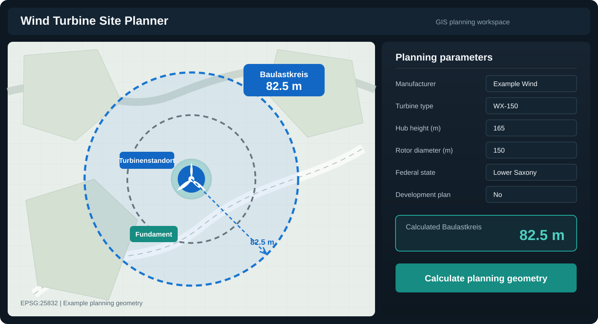

# Hi, I'm Ahmad Fahim Omar 👋

### GIS Analyst & Developer

I develop geospatial tools and automated workflows for spatial analysis, data processing, and renewable-energy planning. My work focuses on turning complex GIS processes into reliable, reusable, and user-friendly solutions.

📍 Hamburg, Germany

## What I work with

- **GIS development:** ArcGIS Pro, ArcGIS Pro SDK for .NET, ArcPy
- **Web GIS:** ArcGIS Experience Builder and ArcGIS APIs
- **Geospatial Python:** GDAL, GeoPandas, Shapely, Pyogrio and PyProj
- **Data processing:** Pandas, NumPy and spatial databases
- **Development:** Python, C#/.NET, Qt and Git
- **Focus areas:** GIS automation, desktop GIS applications, spatial data processing and renewable energy

---

# Featured Project: Wind Turbine Site Planner

**Wind Turbine Site Planner** is an ArcGIS Pro geoprocessing tool for preparing and validating wind-turbine planning data. Its main focus is the automated calculation of the German **Baulastkreis** according to the selected federal state, planning context and turbine geometry.

## Baulastkreis calculation

Baulast requirements for wind turbines are not represented by one universal calculation. The tool selects the applicable rule using:

- the selected **Bundesland**
- whether a **Bebauungsplan** applies
- the state-specific eccentricity method
- the technical dimensions of the selected turbine

The calculation uses the following variables:

| Variable | Meaning |
|---|---|
| **tf** | Tower base diameter |
| **nh** | Hub height |
| **rr** | Rotor radius |
| **exz_mitte** | Eccentricity at rotor centre |
| **exz_oben** | Eccentricity at upper rotor position |

Depending on the selected rule, the calculation combines the relevant turbine dimensions and eccentricity parameters using the applicable state-specific method. Parameter changes are validated immediately, and the calculated value can be written to the output features together with a spatial buffer for map-based review.

## Calculated and enriched outputs

| Output | Description |
|---|---|
| Total turbine height | Overall height from the foundation reference to the upper rotor tip |
| Height above ground level | Turbine height relative to ground level, including foundation elevation or depth |
| Ground elevation | Terrain elevation sampled for each turbine location |
| Rotor geometry | Rotor diameter and rotor radius of the selected turbine model |
| Foundation geometry | Foundation radius and elevation/depth values |
| Eccentricity | Applicable centre or upper eccentricity according to the selected state rule |
| Baulastkreis | Calculated state-specific Baulast radius and its spatial review buffer |
| Turbulence distances | Additional distance zones for preliminary spatial assessment |
| Location attributes | Federal state, parcel and other available administrative information |

The tool also provides automatic turbine-parameter lookup, validation inside the ArcGIS Pro dialog, attribute enrichment, and support for **EPSG:25832** and **EPSG:25833**.

**Technology:** Python · ArcPy · ArcGIS Pro · Geoprocessing

> The source code, calculation tables and project data are maintained in a private repository.

## Current interests

- Scalable GIS tools and reusable processing workflows
- Desktop GIS applications independent of proprietary processing extensions
- Renewable-energy and wind-project assessment
- Geospatial APIs, data integration and workflow automation
- Practical applications of AI in GIS

## Connect with me

[LinkedIn](https://www.linkedin.com/in/ahmad-fahim-omar-9bb95b272/)
